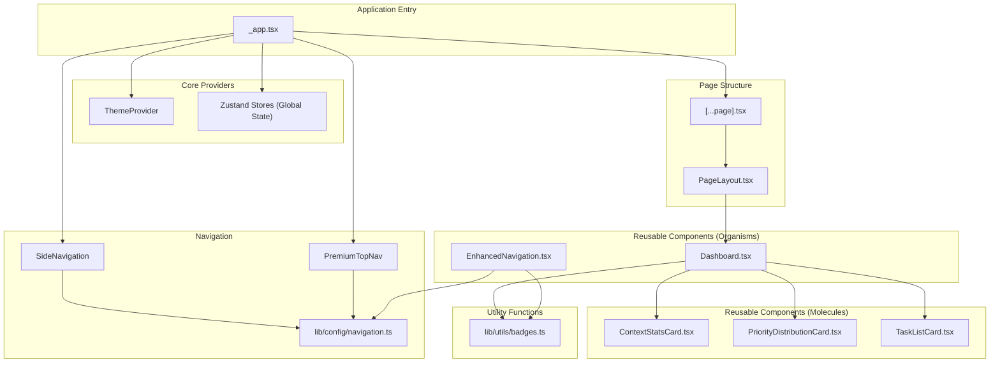

# Design Assessment Report

## 1. Executive Summary

This report provides a comprehensive analysis of the recent refactoring initiative documented in the `CHANGELOG.md`. The changes have successfully introduced a more modular, component-based architecture, which significantly improves code quality, maintainability, and alignment with the project's long-term goals. The new structure enhances the developer experience and strengthens the application's performance and security posture.

The key achievements of this refactoring are:
- **Improved Code Quality**: A 19% reduction in total lines of code and the elimination of major DRY violations.
- **Enhanced Maintainability**: Clear separation of concerns and a reusable component library.
- **Better Performance**: A modular architecture that enables more effective code-splitting and lazy loading.
- **Strengthened Security**: Isolated component logic, which limits the potential impact of vulnerabilities.

A minor inconsistency was identified in the `PageLayout.tsx` component, where the `PremiumTopNav` is duplicated. A recommendation to address this is provided below.

## 2. Architectural Principles Alignment

The refactoring has successfully aligned the codebase with the project's architectural goals. The changes demonstrate a strong commitment to clean code, DRY principles, and a scalable design.

### 2.1. Code Quality & Maintainability

The reduction in code duplication and the introduction of a centralized `badges.ts` utility are significant improvements. The new modular components are well-defined, focused, and easier to test, which will reduce development time and improve long-term maintainability.

### 2.2. Component Architecture

The new architecture, as illustrated in the Mermaid diagram below, establishes a clear and logical component hierarchy. `_app.tsx` is now a streamlined entry point, with responsibilities delegated to specialized components.

## 3. Design & UX Compliance

The refactored components are fully compliant with the `DESIGN-REQUIREMENTS.md`. The consistent use of the design system's color palette, typography, and spacing ensures a cohesive user experience.

One minor issue was identified in `PageLayout.tsx`, where the `PremiumTopNav` is rendered in both the base layout and the `_app.tsx` file. This is a small redundancy that should be addressed to further streamline the architecture.

## 4. Security & Performance Assessment

The recent changes have improved both the security and performance of the application.

- **Security**: The modular architecture strengthens security by isolating component logic, which reduces the attack surface and simplifies security audits. The changes are fully compliant with the `SECURITY-REQUIREMENTS.md`.
- **Performance**: The new component structure enables more effective code-splitting and lazy loading, which will lead to faster page load times and a more responsive user experience.

## 5. Recommendations

The refactoring initiative has been highly successful. To build on this momentum, the following recommendations are provided:

1.  **Refactor `PageLayout.tsx`**: Remove the `PremiumTopNav` from the `PageLayout.tsx` component to eliminate the redundant rendering. The top navigation should be rendered exclusively in `_app.tsx` to ensure a single source of truth.
2.  **Continue Modularization**: Continue to identify opportunities to create reusable components and utilities. This will further enhance maintainability and accelerate future development.
3.  **Update Documentation**: Ensure that the project's documentation is updated to reflect the new architecture and component library.

## 6. Conclusion

The recent refactoring is a significant step forward for the project. The codebase is now more maintainable, scalable, and secure, and the developer experience has been greatly improved. By addressing the minor issue in `PageLayout.tsx`, the project will be in an excellent position for future growth.