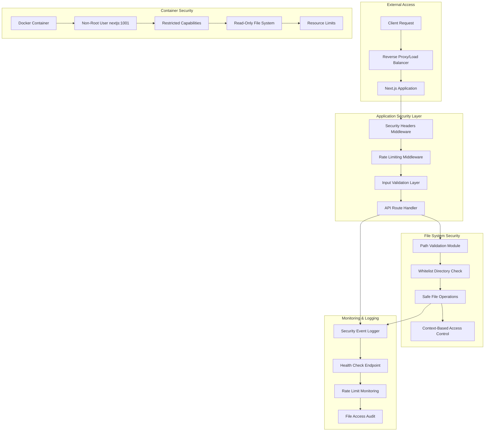
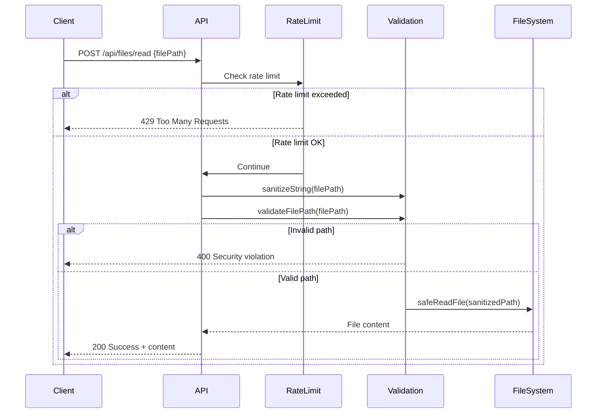
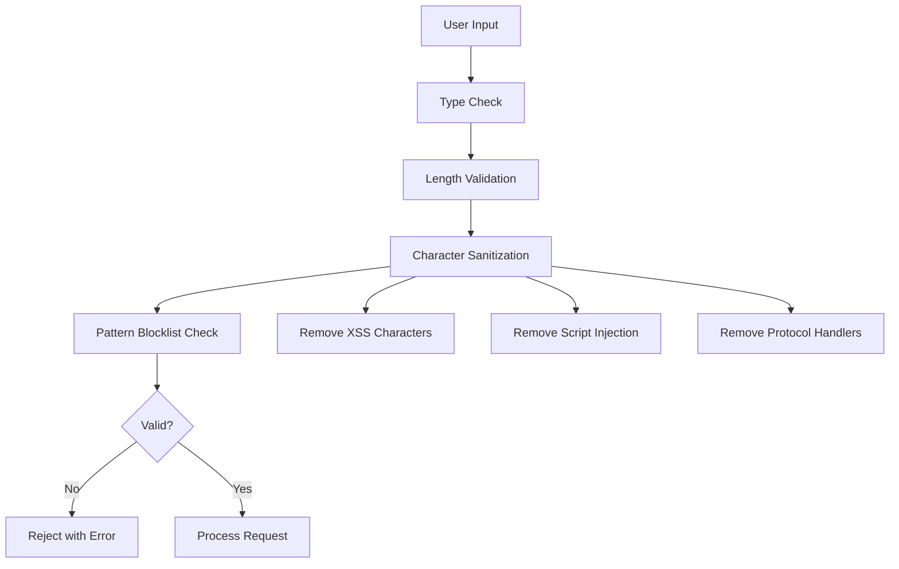

# Security Architecture - GTD Org Front

## 🏗️ Security Architecture Overview

This document provides detailed technical information about the security architecture implemented in the GTD Org Front application.

## 📊 Security Layer Diagram



## 🔒 Security Components

### 1. Path Validation Module (`src/lib/security/pathValidation.ts`)

**Purpose**: Prevents path traversal attacks and ensures file access is restricted to allowed directories.

**Key Features**:
- Whitelist-based directory validation
- Regex pattern blocklist for malicious patterns
- Path normalization and resolution
- File extension validation
- Unicode and encoding attack prevention

**Configuration**:
```typescript
const DEFAULT_CONFIG: SecurityConfig = {
  allowedDirectories: [
    process.env.ORG_WORK_DIR || path.join(process.cwd(), 'org-files/work'),
    process.env.ORG_HOME_DIR || path.join(process.cwd(), 'org-files/home'),
    path.join(process.cwd(), 'tests/fixtures') // Testing only
  ],
  allowedExtensions: ['.org'],
  maxPathLength: 500,
  blocklistPatterns: [
    /\.\./,           // Path traversal
    /~\//,            // Home directory expansion
    /\$\{.*\}/,       // Variable expansion
    /\|/,             // Pipe commands
    /;/,              // Command separation
    /&/,              // Command chaining
    /`/,              // Command substitution
    /\x00/,           // Null bytes
    /[\x01-\x1f\x7f-\x9f]/, // Control characters
  ]
}
```

### 2. Rate Limiting Module (`src/lib/security/rateLimiting.ts`)

**Purpose**: Prevents API abuse and DoS attacks through configurable rate limiting.

**Implementation**: In-memory rate limiting with IP-based client identification.

**Rate Limits**:
- **General API**: 100 requests per 15 minutes
- **File Read**: 30 requests per minute
- **File List**: 20 requests per minute

**Features**:
- Automatic cleanup of expired entries
- Configurable time windows and limits
- Rate limit headers in responses
- Integration with security middleware

### 3. Security Headers (`next.config.js`)

**Purpose**: Implements defense-in-depth through HTTP security headers.

**Headers Implemented**:
```javascript
{
  'X-Content-Type-Options': 'nosniff',
  'X-Frame-Options': 'DENY',
  'X-XSS-Protection': '1; mode=block',
  'Referrer-Policy': 'strict-origin-when-cross-origin',
  'Permissions-Policy': 'camera=(), microphone=(), geolocation=(), browsing-topics=()',
  'Content-Security-Policy': [
    "default-src 'self'",
    "script-src 'self' 'unsafe-eval' 'unsafe-inline'",
    "style-src 'self' 'unsafe-inline'",
    "img-src 'self' data: blob:",
    "font-src 'self'",
    "connect-src 'self'",
    "frame-ancestors 'none'",
    "base-uri 'self'",
    "form-action 'self'"
  ].join('; '),
  'Strict-Transport-Security': 'max-age=31536000; includeSubDomains; preload'
}
```

### 4. Container Security (`Dockerfile` & `docker-compose.yml`)

**Purpose**: Implements container-level security hardening.

**Security Features**:
- **Non-root execution**: Uses `nextjs:1001` user
- **Capability dropping**: Removes unnecessary Linux capabilities
- **Resource limits**: CPU and memory constraints
- **Read-only mounts**: Application code mounted read-only
- **Security contexts**: `no-new-privileges` and restricted syscalls

**Container Configuration**:
```yaml
security_opt:
  - no-new-privileges:true
cap_drop:
  - ALL
cap_add:
  - CHOWN
  - DAC_OVERRIDE
  - SETGID
  - SETUID
deploy:
  resources:
    limits:
      memory: 512M
      cpus: '0.5'
```

## 🔐 Security Flows

### File Read Security Flow



### Input Validation Flow



## 🛡️ Attack Vector Mitigation

### 1. Path Traversal Attacks

**Attack**: `../../etc/passwd`
**Mitigation**: 
- Path normalization before validation
- Regex blocklist for `..` patterns
- Absolute path resolution and whitelist checking

### 2. XSS Attacks

**Attack**: `<script>alert('xss')</script>`
**Mitigation**:
- Input sanitization removing `<>\"'` characters
- CSP headers preventing inline script execution
- Safe HTML rendering in React components

### 3. DoS Attacks

**Attack**: Rapid API requests to overwhelm server
**Mitigation**:
- Per-IP rate limiting with configurable windows
- Resource limits in container deployment
- Request size limitations

### 4. File System Attacks

**Attack**: Access to system files outside org directories
**Mitigation**:
- Whitelist-only directory access
- File extension validation
- Container file system restrictions

### 5. Injection Attacks

**Attack**: Command injection through user inputs
**Mitigation**:
- Comprehensive input validation
- No direct command execution
- Parameterized file operations only

## 📋 Security Testing

### Automated Security Checks

1. **Path Validation Tests**:
```typescript
// Test path traversal prevention
expect(validateFilePath('../../etc/passwd')).toEqual({
  isValid: false,
  error: expect.stringContaining('forbidden pattern')
})
```

2. **Rate Limiting Tests**:
```typescript
// Test rate limit enforcement
for (let i = 0; i < 31; i++) {
  await request(app).post('/api/files/read')
}
expect(response.status).toBe(429)
```

3. **Input Sanitization Tests**:
```typescript
// Test XSS prevention
const maliciousInput = '<script>alert("xss")</script>'
const sanitized = sanitizeString(maliciousInput)
expect(sanitized).not.toContain('<script>')
```

### Manual Security Testing

1. **Path Traversal Testing**:
   - Test various `../` combinations
   - Test URL-encoded path traversal
   - Test null byte injection
   - Test Unicode normalization attacks

2. **Rate Limiting Testing**:
   - Burst request testing
   - Sustained request testing
   - Multiple IP testing

3. **Container Security Testing**:
   - User privilege verification
   - File system access testing
   - Resource limit testing

## 🔧 Security Configuration

### Environment Variables

```bash
# Security-related environment variables
ORG_WORK_DIR=/app/org-files/work
ORG_HOME_DIR=/app/org-files/home
ENABLE_AUTO_BACKUP=true
MAX_BACKUP_COUNT=10
DEBUG=false
NODE_ENV=production
```

### CSP Configuration

The Content Security Policy is configured to:
- Block inline scripts and styles where possible
- Restrict resource loading to same origin
- Prevent frame embedding
- Block dangerous protocols

### Rate Limiting Configuration

Rate limits are configurable per endpoint type:
- Adjust `windowMs` for time window
- Adjust `maxRequests` for request limits
- Configure different limits for different endpoints

## 🚨 Security Monitoring

### Logged Security Events

- Failed authentication attempts (future feature)
- Rate limiting violations
- Path validation failures
- File access outside allowed directories
- Input validation failures
- Container privilege escalation attempts

### Monitoring Endpoints

- **Health Check**: `/api/health` - Application health status
- **Security Status**: Monitor rate limiting headers
- **Error Rates**: Track 4xx responses for security violations

## 🔄 Security Maintenance

### Regular Tasks

1. **Dependency Updates**: Monthly security patches
2. **Security Reviews**: Quarterly architecture reviews
3. **Penetration Testing**: Annual third-party testing
4. **Log Analysis**: Weekly security log reviews

### Security Metrics

- Rate limiting hit rate
- Path validation rejection rate
- Input sanitization trigger rate
- Container security violations
- File access patterns

This architecture provides comprehensive security coverage while maintaining the application's performance and usability requirements.

---

**Document Version**: 1.0  
**Last Updated**: January 2025  
**Next Review**: March 2025